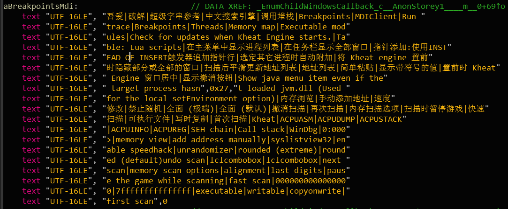

## simple

安卓题，拖进JEB，发现动态创建了一个dex

```java
public class FindAssetfile {
    public FindAssetfile() {
        super();
    }

    public static byte[] crypt(byte[] arg13, String arg14) {
		//解密函数略...
    }

    public static File getAssetsFile(Context arg15, String arg16, String arg17, Method arg18) {
        ByteArrayOutputStream v1;
        InputStream v7;
        AssetManager v9 = arg15.getAssets();
        String v8 = "E82038F4B30E810375C8365D7D2C1A3F";
        try {
            v7 = v9.open(arg16);
            v1 = new ByteArrayOutputStream();
            byte[] v2 = new byte[0x400];
        label_8:
            int v6 = v7.read(v2); //读取test.zip
            if(v6 == 0xFFFFFFFF) {
                goto label_18;
            }

            v1.write(v2, 0, v6); //读出来的数据写进一个ByteArrayOutputStream
            goto label_8;
        }
        //部分异常处理略

    label_18:
        if(arg18 == null) {
            goto label_54;//成立，会跳过去
        }

        Object v11 = null;
        try {
            Object v3 = arg18.invoke(v11, v1.toByteArray());
            goto label_28;
        label_54:
            byte[] v3_1 = v1.toByteArray();
        label_28:
            v7.close();
            v1.close();
            FileOutputStream v10 = new FileOutputStream(new File(arg17));
            v3_1[0] = 113; //重写文件头
            v3_1[1] = 114;
            v3_1[2] = 10;
            v3_1[3] = 8;
            v10.write(FindAssetfile.crypt(v3_1, v8)); //解密成一个dex
            v10.close();
        }
        //部分异常处理略

        return null;
    }
```

所以就还原他的解密算法，把他解密成dex，然后再逆那个dex就好了。这个最后我丢给队友做了，不过那个dex也不难逆，所以不说了。这个既可以动态调试也可以手动解密，都能得出解密后的dex。

## Script In Script

打开发现是个混淆过的js，把两处eval都改成`console.log`，然后Firefox调试信息看输出，就是解密后的代码

```javascript
function a(r) {
    return D(~r, 1)
}


function D(r, n) {
    return n ? D(r ^ n, (r & n) << 1) : r
}


function E(r, n) {
    return D(r, a(n))
}


function F(r, n) {
    var a = 0;
    while (n) {
        if (n & 1) {
            a = D(a, r)
        }
        r = r << 1;
        n = n >> 1
    }
    return a
}


function G(r, n) {
    var a = 0;
    while (r >= n) {
        r = E(r, n);
        a = D(a, 1)
    }
    return a
}


function H(r) {
    return r.length
}


function equal(r, n) {
    return !(r ^ n)
}


function idx_access(r, n) {
    return r[n]
}


function L(r) {
    if (r.length == 1) {
        return r.charCodeAt(0)
    }
}


function M(r) {
    return +r
}


function N(r) {
    return String(r)
}


function O(r, n) {
    return r + n
}


function Q(r, n, a, v) {
    for (var t = r; t <= n; t++) {
        if (a[t] != v[t - r]) {
            return false
        }
    }
    return true
}


function r(r) {//参数是输入，要让他返回true
    var n = r;
    var a = H(n);
    var v = equal(a, 24);
    var t = idx_access(n, 0);
    var u = idx_access(n, 1);
    var i = idx_access(n, 2);
    var e = idx_access(n, 3);
    var f = D(L(t), L(i));
    var o = E(L(t), L(u));
    var c = idx_access(n, 6);
    var l = idx_access(n, 7);
    var h = idx_access(n, 16);
    var w = idx_access(n, 17);
    var I = equal(E(L(u), L(h)), 0);
    var S = equal(D(L(c), L(l)), D(L(h), L(w)));
    var _ = equal(E(L(u), L(c)), 0);
    var g = idx_access(n, 21);
    var p = idx_access(n, 22);
    var s = equal(E(F(L(g), 2), G(66, L(p))), 64);
    var P = Q(9, 15, n, "Pt_In_S");
    var T = equal(L(l), L("r"));
    var b = equal(f, 231);
    var d = equal(o, 16);
    var j = M(idx_access(n, 5));
    var k = equal(G(M(O(N(L(e)), "0")), j), 204);
    var m = M(idx_access(n, 8));
    var q = Q(18, 20, n, "IpT");
    var x = equal(E(j, m), 4);
    var y = equal(F(m, m), m);
    var z = equal(D(L(idx_access(n, 4)), D(m, m)), L(idx_access(n, 23)));
    var A = equal(L(u), 99);
    var B = equal(L(idx_access(n, 23)), 125);
    var C = equal(L(idx_access(n, 22)), 33);
    return v && I && S && _ && s && P && T && b && d && k && q && x && y && z && A && B && C
}
//F = *, D = +, E = -, G = /
```

然后经过调试发现`F = *, D = +, E = -, G = /`，即加减乘除。

（这个坑了我好久，之前看起来以为是一个hash之类的函数，所以写了个C++爆破，结果发现在特定位置可能的字符集收敛不了，然后我就调试想看我写的爆破程序是不是哪里有问题，一调就发现了这其中的奥妙。。。不过这种用位运算实现的加减乘除我还是第一次见，也跟数字电路里面那个全加器什么的不一样）

最后手撸`r`函数的验证算法，其实就是一个方程。具体是啥被我删了（严格的来讲是解方程的时候慢慢手动消掉变成解了），然后要注意的是他获取数据的时候有时候是获取ascii码有时候是获取字符数字的值（ASCII值减去'0'的ASCII值），然后有一个乘10的实现也是挺有意思的，字符串后面加个0再转回乘数字

`equal(F(m, m), m)`是求解的关键点，`m*m=m`所以m只能是1或者0，我先试的1结果直接拿到flag了，0估计会有问题（不然会多解，可是我也没试了）

最后解得

```javascript
n5=5
n8=1
x2=116
x0=115
x16=99
x17=114
x6=99
x21=33
x7=114
x3=102
x4=123
x1=99
x23=125
x22=33

//sctf{5cr1Pt_In_ScrIpT!!}
```

## Where is my 13th count?

默默吐槽一下不应该是13rd吗（逃

首先是一个U3D游戏，一共只有12个方块可以吃，但是根据题目名称应该要吃13个方块。打开CE，发现瞬间CE和游戏都退出了，说明估计有检测，打开一看果然

 

然后过检测，就是把这些字符串全部清空。

可是发现到了13个还是没反应，用dotPeek一看`Assembly-CSharp.dll`发现是14个才会有反应，这大概就是题目名有语法错误的原因？

```c#
  private void SetCountText()
  {
    this.countText.text = "Count: " + this.count.ToString();
    if (this.count < 14)
      return;
    this.winText.text = "Don't Eat Your Flag!";
    this.floor.transform.position = new Vector3(this.floor.transform.position.x, this.floor.transform.position.y - 2f, this.floor.transform.position.z);
  }
```

所以CE改内存，扫出来一共有好几个，跟传统native游戏不大一样，可能是虚拟机的原因吧没深究，就全部改了。14个的时候成功出现flag。

## Babymips

retdec的在线反编译挂了。。然后IDA插件死活安装不上，一直有问题，搞不懂这帮大佬有这么多精力写开源项目没精力把自己的项目做的更user friendly，明明最后一个也是很关键的一环。。。然后我也是真是体会到了做题5分钟，配置2小时。。。

所以最后是手撸汇编的，也是当做学习了一波mips汇编了。。。

打开main函数

```assembly
lw      $gp, 0x880+unknown($fp)
lui     $v0, 0x40
addiu   $a0, $v0, (aPlzInputFlag - 0x400000)  # "plz input flag : "
la      $v0, printf
move    $t9, $v0
jalr    $t9 ; printf
nop
lw      $gp, 0x880+unknown($fp)
addiu   $v0, $fp, 0x880+input
move    $a1, $v0
lui     $v0, 0x40
addiu   $a0, $v0, (aS - 0x400000)  # "%s"
la      $v0, scanf
move    $t9, $v0
jalr    $t9 ; scanf
nop
lw      $gp, 0x880+unknown($fp)
addiu   $v0, $fp, 0x880+input
move    $a0, $v0         # s
la      $v0, strlen
move    $t9, $v0
jalr    $t9 ; strlen
nop
lw      $gp, 0x880+unknown($fp)
sw      $v0, 0x880+len($fp)
lw      $v1, 0x880+len($fp)
li      $v0, 0x26
beq     $v1, $v0, loc_400E44
```

获取输入并且判断长度为0x26，不说了。

```assembly
loc_400E60:
lw      $v1, 0x880+i($fp)
lw      $v0, 0x880+len($fp)
slt     $v0, $v1, $v0
beqz    $v0, break_loop1  # i<len
nop
lw      $v0, 0x880+i($fp)
addiu   $v1, $fp, 0x880+saved_fp
addu    $v0, $v1, $v0
lb      $v1, -0x838($v0)  # v1=input[i]
lw      $v0, 0x880+i($fp)
andi    $v0, 0xFF
addiu   $v0, 1
andi    $v0, 0xFF
sll     $v0, 24          # (i+1)
sra     $v0, 24
xor     $v0, $v1, $v0
sll     $v1, $v0, 24
sra     $v1, 24          # input[i]^(i+1)
lw      $v0, 0x880+i($fp)
addiu   $a0, $fp, 0x880+saved_fp
addu    $v0, $a0, $v0
sb      $v1, -0x838($v0)  # input[i]=input[i]^(i+1)
lw      $v0, 0x880+i($fp)
addiu   $v0, 1
sw      $v0, 0x880+i($fp)
b       loc_400E60
nop
```

第一个循环，对input进行第一次处理，`input[i]=input[i]^(i+1)`

```assembly
lw      $v1, 0x880+main_addr($fp)
lw      $v0, 0x880+proc2_addr($fp)
subu    $v0, $v1, $v0
sw      $v0, 0x880+main_minus_proc2($fp)
sw      $zero, 0x880+j($fp)
loc_400EE0:
lw      $v1, 0x880+j($fp)
lw      $v0, 0x880+main_minus_proc2($fp)
slt     $v0, $v1, $v0
beqz    $v0, break_loop2
nop
lw      $v0, 0x880+j($fp)
lw      $v1, 0x880+proc2_addr($fp)
addu    $v0, $v1, $v0
move    $a0, $v0
jal     func
nop
lw      $gp, 0x880+unknown($fp)
move    $v1, $v0
lw      $v0, 0x880+j($fp)
addiu   $a0, $fp, 0x880+saved_fp
addu    $v0, $a0, $v0
sb      $v1, -0x7D4($v0)  # res[j]=func(proc[j])
lw      $v0, 0x880+j($fp)
addiu   $v0, 1
sw      $v0, 0x880+j($fp)
b       loc_400EE0
nop
```

其中func为

```assembly
.vmp0:00400A90                 addiu   $sp, -0x10
.vmp0:00400A94                 sw      $fp, 0x10+var_4($sp)
.vmp0:00400A98                 move    $fp, $sp
.vmp0:00400A9C                 sw      $a0, 0x10+keys_j($fp)
.vmp0:00400AA0                 sb      $zero, 0x10+var_E($fp)
.vmp0:00400AA4                 sb      $zero, 0x10+var_F($fp)
.vmp0:00400AA8                 sb      $zero, 0x10+var_D($fp)
.vmp0:00400AAC                 sw      $zero, 0x10+i($fp)
.vmp0:00400AB0                 sw      $zero, 0x10+i($fp)
.vmp0:00400AB4 begin_loop:                              # CODE XREF: func+8C↓j
.vmp0:00400AB4                 lw      $v0, 0x10+i($fp)
.vmp0:00400AB8                 slti    $v0, 8
.vmp0:00400ABC                 beqz    $v0, break_loop
.vmp0:00400AC0                 nop
.vmp0:00400AC4                 lw      $v0, 0x10+keys_j($fp)
.vmp0:00400AC8                 lb      $v0, 0($v0)
.vmp0:00400ACC                 move    $v1, $v0         # v1=k[j]
.vmp0:00400AD0                 lw      $v0, 0x10+i($fp)
.vmp0:00400AD4                 srav    $v0, $v1, $v0
.vmp0:00400AD8                 sb      $v0, 0x10+var_D($fp)  # d=k[j]>>i
.vmp0:00400ADC                 lbu     $v0, 0x10+var_D($fp)
.vmp0:00400AE0                 andi    $v0, 1
.vmp0:00400AE4                 sb      $v0, 0x10+var_E($fp)  # e=d&1
.vmp0:00400AE8                 lb      $v1, 0x10+var_E($fp)
.vmp0:00400AEC                 li      $a0, 7
.vmp0:00400AF0                 lw      $v0, 0x10+i($fp)
.vmp0:00400AF4                 subu    $v0, $a0, $v0    # v0=7-i
.vmp0:00400AF8                 sllv    $v0, $v1, $v0    # v1=e<<(7-i)
.vmp0:00400AFC                 sll     $v1, $v0, 24
.vmp0:00400B00                 sra     $v1, 24
.vmp0:00400B04                 lbu     $v0, 0x10+var_F($fp)
.vmp0:00400B08                 or      $v0, $v1, $v0
.vmp0:00400B0C                 sb      $v0, 0x10+var_F($fp)  # f=(e<<(7-i))|f
.vmp0:00400B10                 lw      $v0, 0x10+i($fp)
.vmp0:00400B14                 addiu   $v0, 1
.vmp0:00400B18                 sw      $v0, 0x10+i($fp)
.vmp0:00400B1C                 b       begin_loop
.vmp0:00400B20                 nop
.vmp0:00400B24
.vmp0:00400B24 break_loop:                              # CODE XREF: func+2C↑j
.vmp0:00400B24                 lb      $v0, 0x10+var_F($fp)
.vmp0:00400B28                 move    $sp, $fp
.vmp0:00400B2C                 lw      $fp, 0x10+var_4($sp)
.vmp0:00400B30                 addiu   $sp, 0x10
.vmp0:00400B34                 jr      $ra
.vmp0:00400B38                 nop
```

反正就是做一些运算，对什么数据做的运算不清楚，是全局的数据，一开始以为是与flag相关的keys，结果并不是

回到main函数

```assembly
break_loop2:
addiu   $v1, $fp, 0x880+res
lui     $v0, 0x41
sw      $v1, off_412060
lw      $v0, off_412060
addiu   $a0, $fp, 0x880+input
li      $a2, 0x26
lui     $v1, 0x41
addiu   $a1, $v1, 0x2010  # a1=keys
move    $t9, $v0
jalr    $t9 
#这里很关键，call到栈上的一个地址了，然后这个地址是前面func解密后的数据
#推测，前面那个循环是从全局取数据，func处理，然后赋值到栈上
#这里直接调用解密后的代码，所以IDAPython解密一波
nop
lw      $gp, 0x880+unknown($fp)
sltiu   $v0, 1
andi    $v0, 0xFF
beqz    $v0, fail
nop
```

```python
def decode(b):
	d=0
	e=0
	f=0
	for i in xrange(0,8):
		d=b>>i
		e=d&1
		f=(e<<(7-i))|f
	return f

def ext_sign(b):
	return b if b&128==0 else b|(~255)
#符号处理一下，因为他这里用的是arithmetic shift right
for p in xrange(0x00400B3C,0x00400D14):
	PatchByte(p, decode(ext_sign(Byte(p))))
```

解密后的代码就是先异或0x30`input[i]=input[i]^0x30`，再把中间`[5:0x25]`的字节再与`"sctf"`字符串异或

关键代码片段

```assembly
# ....
lw      $v0, 0x40+i($fp)
lw      $v1, 0x40+input($fp)
addu    $v0, $v1, $v0
lw      $v1, 0x40+i($fp)
lw      $a0, 0x40+input($fp)
addu    $v1, $a0, $v1
lb      $v1, 0($v1)      # v1=input[i]
xori    $v1, 0x30
sll     $v1, 24
sra     $v1, 24
sb      $v1, 0($v0)      # input[i]=input[i]^0x30
lw      $v0, 0x40+i($fp)
addiu   $v0, 1
sw      $v0, 0x40+i($fp)
b       loc_400BAC
nop
# ....
loc_400C6C:
addiu   $a1, $fp, 0x40+var_8
addu    $v0, $a1, $v0 # v0 = (j-5) mod 4
lb      $v0, -0xC($v0)   # sctf
xor     $v0, $a0, $v0 # xor
sll     $v0, 24
sra     $v0, 24
sb      $v0, 0($v1)
lw      $v0, 0x40+j($fp)
addiu   $v0, 1
sw      $v0, 0x40+j($fp)
b       loc_400C14
nop
# ....
```

最后破解脚本

```python
keys = [0x72, 0x61, 0x77, 0x62, 0x7E, 7, 0x35, 0x2E, 0x26
 ,0x24, 0x31, 0x38, 0x28, 0x12, 0x35, 7, 0x18, 0x22
 ,0x2F, 0xF, 0x26, 0x34, 0x71, 0x25, 0x10, 0x20, 0x27
 ,0x37, 0x24, 0x32, 0x23, 0xB, 0x18, 0xE, 0x1F, 0xF
 ,0x52, 0x5B]

def decode(enc):
	sctf = "sctf";
	for i in xrange(5,0x25):
			enc[i] ^= ord(sctf[(i-5)%4])
	for i in xrange(0,0x26):
			enc[i] ^= 0x30
			enc[i] ^= (i+1)
	print "".join(map(chr,enc))

decode(keys)
#CSDVKBabymips_iS_so_ea5y_yoooooooooo!M
```

可是不大对，加上sctf\{\}也不对，看了一下mips里面的确有一段地方是只取了`[5:0x25]`，所以试一下`sctf{Babymips_iS_so_ea5y_yoooooooooo!}`，发现是flag。。。（话说是我写错了吗，怎么都得不到这个。。。）
